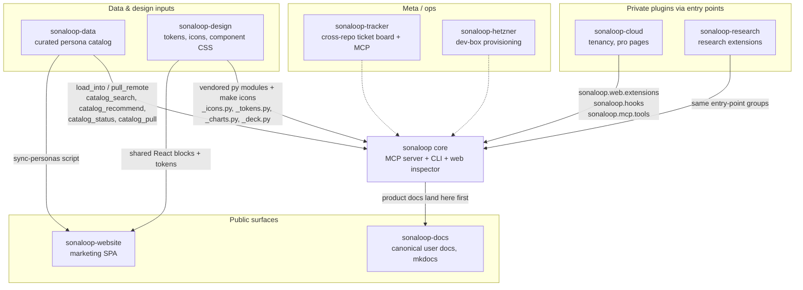
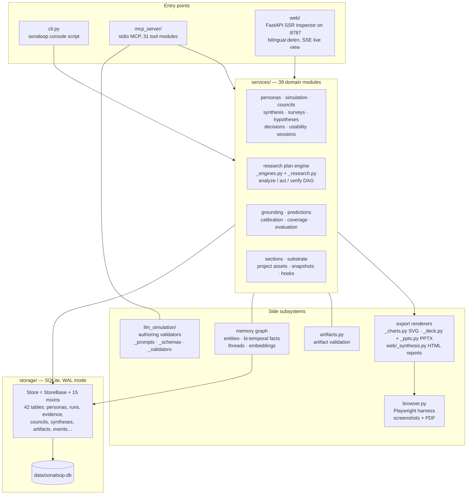
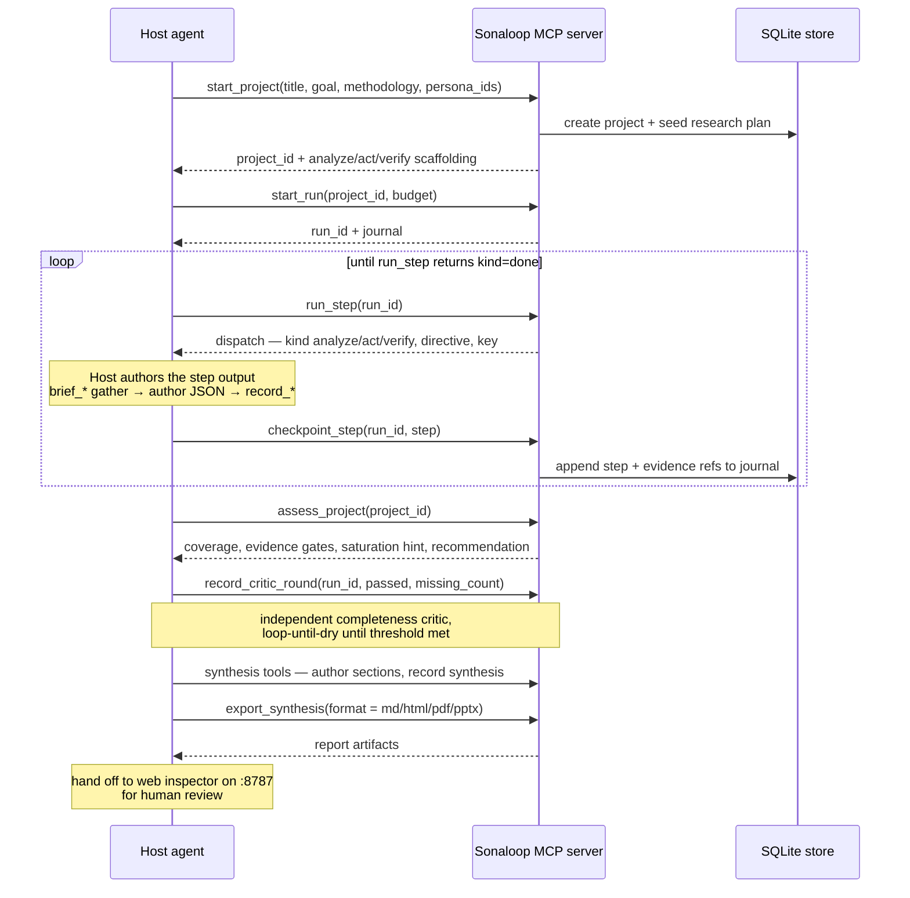

# Architecture

Sonaloop is an MCP server for customer-persona simulation, councils, and design-research
synthesis. Personas are persistent agents with durable `SOUL.md` files, timestamped
calendars, experience logs, and a bi-temporal memory graph. The defining constraint:
**the host agent authors all text — there are no server-side text-LLM calls.** Every
generative step follows the same contract: `brief_*` (server gathers context) → host
authors JSON → `record_*` / `put_*` (server validates and persists).

This file is the orientation map for new developers. Deeper, evolving design notes live
in [`spec/`](spec/) (notably `memory-and-simulation-architecture.md`,
`planning-and-evidence-architecture.md`, `component-ssr-architecture.md`) and the
agent-facing contracts in [`docs/`](docs/README.md).

## Ecosystem

Sonaloop core is the open-core hub. Private packages plug in via Python entry-point
groups; sibling repos feed it data, design assets, and documentation.

Integration mechanics:

- **Entry-point groups** — core discovers plugins via `importlib.metadata`, never
  imports them directly: `sonaloop.mcp.tools` (loaded in `mcp_server/__init__.py`),
  `sonaloop.web.extensions` (loaded in `web/_ext.py`), `sonaloop.hooks` (loaded in
  `services/_hooks.py`).
- **sonaloop-data** is an optional lazy import. If absent, `mcp_server/_tools_catalog.py`
  falls back to a small stdlib-urllib client against the published catalog
  (`manifest.json`, `packs/<id>.json`, `personas/<slug>/…`), so browse + pull work
  from any install.
- **sonaloop-design** is vendored, not depended on: `make icons` syncs `_icons.py` /
  `_tokens.py` from `../sonaloop-design`; `make check-icons` runs as a pre-push hook
  to catch drift.

## Core repo layers

Three entry points share one service layer over one SQLite store.

Key points per layer:

- **Entry points.** `cli.py` (`sonaloop`), `mcp_server` (`sonaloop-mcp`, stdio), and
  `web` (`sonaloop-web`, FastAPI server-side-rendered inspector on `:8787`,
  `make dev-forwarded` exposes `:18787`). The inspector renders HTML in
  `web/_components.py` — no JS framework — and streams lifecycle events over SSE.
- **services/** holds all business logic; entry points stay thin. The research plan
  engine (`_engines.py`) dispatches deterministic analyze/act/verify steps;
  `_research.py` owns project graphs and open questions. `_hooks.py` is the
  extensibility seam (lifecycle event bus feeding SSE and plugin listeners).
- **storage/** is a single `Store` class composed from mixins (`PersonasMixin`,
  `SimulationMixin`, `CouncilsMixin`, `ResearchMixin`, `MemoryMixin`, …), 42 tables,
  WAL journal mode. No ORM.
- **Memory graph** spans `services/_memory.py` + `storage/_memory.py`: entities,
  bi-temporal facts (`t_valid` / `t_invalid` enable time-travel queries), threads
  (open loops), and optional embeddings for hybrid semantic recall
  (`OPENAI_API_KEY` enables embeddings + avatars only — never text generation).
- **Exports**: Markdown, JSON, self-contained HTML, PDF (via Playwright), and native
  PPTX with charts (`_deck.py`, `_pptx.py`, `_pptx_charts.py`); SVG charts in
  `_charts.py` use vendored design tokens.

## Governed research run loop

The end-to-end flow a host agent drives through MCP. The server returns deterministic
dispatches; the host authors every artifact.

## Module map

| Path | Role |
| --- | --- |
| `sonaloop/cli.py` | CLI entry point (`sonaloop`), ~45 command handlers |
| `sonaloop/mcp_server/` | stdio MCP server, 31 tool modules, plugin loader |
| `sonaloop/web/` | FastAPI SSR inspector (`:8787`), SSE, bilingual docs hub (`_docs_content.py`) |
| `sonaloop/services/` | 39 domain modules — all business logic |
| `sonaloop/storage/` | SQLite WAL store, `StoreBase` + mixins, 42 tables |
| `sonaloop/llm_simulation/` | Authoring contract: prompts, JSON schemas, validators |
| `sonaloop/artifacts.py` | Artifact validation + lifecycle |
| `sonaloop/browser.py` | Playwright harness (optional, degrades gracefully) |
| `sonaloop/_charts.py` / `_deck.py` / `_pptx.py` | SVG charts and PPTX export (design-system vendored) |
| `sonaloop/_pptx_preview.py` | First-slide PPTX→PNG rasterizer (document file-card previews) |
| `sonaloop/prototype_templates/`, `methodologies/`, `suggestions/` | Static catalogs |
| `spec/` | Living design specs (architecture trackers) |
| `docs/` | Deep agent-facing contracts; canonical user docs live in sonaloop-docs |

## Data flow & portability

- **Data dir** resolution: `SONALOOP_DATA_DIR` env var → `./data/` in a source
  checkout → `~/.local/share/sonaloop` when installed. Everything user-generated
  lives there; it is git-ignored and never leaves the machine.
- **`sonaloop.db`** is a single SQLite file (WAL mode, so `.db-wal` / `.db-shm`
  sidecars appear while running).
- **Snapshots**: `export_snapshot` (`make snapshot`) writes a portable JSON + SOUL.md
  + embeddings tree to `data/export/`; `import_snapshot` (`make restore`) rebuilds the
  runtime DB, avatars, and SOULs on another machine — exact state moves without
  regeneration.
