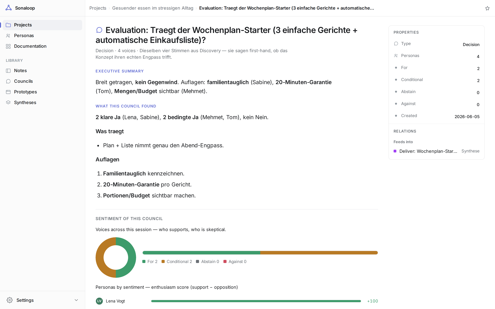
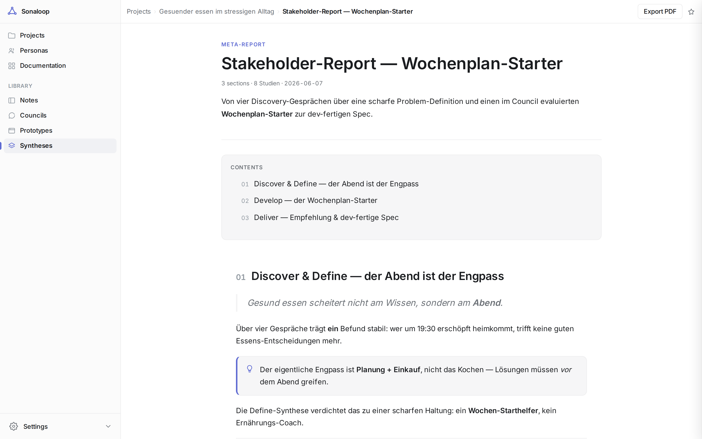
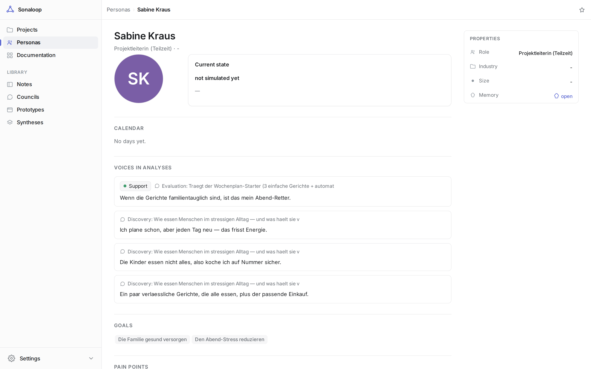

<p align="center">
  
</p>

# Sonaloop

**An MCP server for customer-persona simulation, councils, and design-research synthesis.**

Sonaloop models customer profiles as persistent agents — durable `SOUL.md` files,
timestamped calendars, activity logs, inner thoughts, evidence, and council-style
debates. The **host agent authors all text**; Sonaloop gathers context, validates,
and persists. There are no server-side text-LLM calls.

Simulation is non-directional: profiles are never nudged toward a product thesis
unless their own source description, evidence, calendar, or explicit task context
supports it.



**Docs:** the canonical documentation lives at **<https://jhoetter.github.io/sonaloop-docs/>** —
start with [Getting started](https://jhoetter.github.io/sonaloop-docs/getting-started/).

## Get started

**Know what MCP is? One sentence per host** (needs [`uv`](https://docs.astral.sh/uv/)):

- **Claude Code**

  ```bash
  claude mcp add sonaloop -- uvx sonaloop-mcp
  ```

- **Claude Desktop / Cursor / any MCP host** — add to the host's MCP config (`mcpServers`):

  ```json
  { "sonaloop": { "command": "uvx", "args": ["sonaloop-mcp"] } }
  ```

That's it — no data dir, no `.env`, no setup step required; the server bootstraps itself on first
touch and your first tool call on a fresh database returns the first steps (project → personas →
council). Optional extras come later: `sonaloop setup` fetches the headless browser for prototype
testing, and an `OPENAI_API_KEY` enables avatars + semantic recall. `sonaloop info` checks the
wiring and prints these exact one-liners when something's missing.

Want something to look at before your first study? Two complete example projects ship with the
install — ask your agent to call `load_example` (or run `sonaloop load-example`, or click
**Load example** on the empty home page of the inspector). `remove_example` removes exactly that
data again. Every supported environment variable is enumerated in [.env.example](.env.example).

### Or: paste this to your AI agent

No setup knowledge needed. Paste the prompt below into an **AI agent that can run commands
on your machine** — e.g. **Claude Code, Cursor, or Codex** (and other local/desktop agents
with terminal access, like the Claude or ChatGPT desktop apps). It detects your environment,
installs Sonaloop the best way, starts the inspector, and walks you through a first project —
you just talk.

> **Chat-only assistant (no local execution)?** It can't install a CLI or start the server —
> use the manual MCP setup in the **Prefer to wire it up yourself?** section below instead.

```text
Set up Sonaloop for me and walk me through a first project. Do every step yourself and keep
me posted; I just want to talk, not configure anything.

1. Install the `sonaloop` CLI in whatever way fits this environment — try `uv tool install
   sonaloop`, else `pipx install sonaloop`, else `pip install --user sonaloop`.
2. Run `sonaloop setup` (it fetches a headless browser) and `sonaloop info` to confirm.
3. Start the web inspector in the background by running `sonaloop-web`, then tell me the URL
   it prints — http://localhost:8787 — so I can watch everything live.
4. If this app supports MCP servers, also register Sonaloop as one (command: `sonaloop-mcp`)
   so you can call its tools directly. Otherwise just drive it via the `sonaloop` CLI — both work.
5. Run `sonaloop guide` and follow it exactly. The key rule: YOU author every piece of text
   (personas, days, council answers, syntheses) — Sonaloop only gathers context and persists.
6. Ask me what I want to research or simulate (any domain). Then create a few personas,
   simulate a little of their lives, run a council on my question, and synthesize the result —
   pointing me to the inspector to read each one.
```

That's the whole onboarding. Everything below is reference.

<details>
<summary>Prefer a permanent install instead of uvx?</summary>

Install the entrypoints (`sonaloop` CLI · `sonaloop-mcp` · `sonaloop-web`):

```bash
uv tool install sonaloop      # or: pipx install sonaloop / pip install --user sonaloop
sonaloop setup                # headless browser for prototype screenshots + PDF export
sonaloop guide                # the agent operating contract + first-run recipe
```

Works in **any MCP host**: the server ships its operating contract as MCP `instructions` and
the workflows as MCP **prompts** (`run_council`, `synthesize`, `design_thinking`,
`compose_research_plan`) — provider-agnostic. Claude Code additionally gets the
`claude-skills/` adapter (auto-trigger + sub-agent fan-out). Full rules: [AGENTS.md](AGENTS.md).
</details>

## The model in one minute

- **Personas** — host-authored profiles, simulated day by day into a **memory graph** they recall + time-travel.
- **Research project** (Double-Diamond) driven by a **plan engine** (`next_action` → analyze/act/verify).
- **Evidence** — memory-grounded **councils**, **prototypes** (personas test them), and **notes**.
- **Synthesis / report** — converges the evidence into the answer (convergence 2×2 or project report, PDF).

Every generative step follows one contract: `brief_*` (gather) → the host authors JSON → `record_*` /
`put_*` (validate + persist). No server-side text-LLM calls.

The full flow, every artefact's data + purpose, and the data model live in the app's **Documentation**
page (sidebar → Documentation, or `/documentation`). Agent operating rules are in [AGENTS.md](AGENTS.md).

## Configuration

`OPENAI_API_KEY` is **optional** — Sonaloop never uses it for text. It only enables
two niceties: persona **avatar images** and **semantic memory recall** (without it,
recall falls back to keyword/recency/importance). Set it in `.env` or the
environment.

When installed, writable state lives in a per-user data dir (`platformdirs`, e.g.
`~/.local/share/sonaloop`); override with `SONALOOP_DATA_DIR`. In a source checkout
it stays under `./data`. Read-only package data (methodology specs, MCP suggestions,
prototype templates) ships inside the wheel. Run `sonaloop purge-runtime-data` for a
clean slate.

## The inspector (web UI)

A read-only, Linear/Notion-grade inspector (`Overview · Personas · Councils ·
Synthesen`): a personas card-grid home, list views, each persona's **🧠 Memory**
page (project timelines, time-travel, recall), and the **Synthese** report as a
Notion-style document with table of contents, callouts, and **PDF export**. Dark
mode, keyboard nav (`g o/p/c/s`, `[`), bilingual (de/en, auto-detected; toggle via
`?lang=de|en` or `sonaloop set-language`). All creation happens via CLI/MCP.

| Synthesis as a report | Persona memory page |
| --- | --- |
| [](docs/assets/sonaloop-report.png) | [](docs/assets/sonaloop-persona.png) |

## Councils & synthesis

- **Council** — personas react to a prompt, grounded in their own memory (each can
  `recall` on demand). The `run-council` skill supports a moderated back-and-forth
  with pluggable strategies (`positive-deepdive`, `pain-discovery`, `tension`,
  `goal`) and a hand-raising convergence loop.
- **Analysis → council loop → synthesis** — the `synthesize` skill is an iterative
  driver: from one statement it runs a council, reads the result, and authors the
  next self-contained question until the goal is met (or `max_councils`, default 10).
  The councils are the log; the **synthesis is the answer/report**.
- **Synthesis = the report** — cross-council prose (arc, recommendations,
  positioning, pain-solvers, segments) plus a structured per-persona **`voices`**
  layer (sentiment, relevance, key argument, shift, evidence quotes). The web report
  is answer-first with an interactive **Stimmen** panel; `export_synthesis` (md/json)
  is self-contained for handing to a downstream agent.

## From source (development)

```bash
git clone https://github.com/jhoetter/sonaloop && cd sonaloop
uv sync
cp .env.example .env          # OPENAI_API_KEY optional
make skills                   # symlink claude-skills/* for Claude Code discovery
make dev                      # web inspector on :8787 (dev-forwarded for :18787)
make mcp                      # MCP server (stdio)
```

Move your exact state between machines **without regenerating** (privately, not via
the public repo): `make snapshot` writes `data/export/` (your portable state), and
`make restore` rebuilds the runtime DB + avatars + SOULs from it. All of `data/`
(and your `spec/persona-source-prompts.md` + `exports/`) is git-ignored and
local-only — your content never leaves your machine.

For releases: bump `version` in `pyproject.toml` (a published version is immutable),
then `uv build && uv publish`. The `uvx sonaloop-mcp` one-liner is backed by the shim
distribution in [`packaging/sonaloop-mcp/`](packaging/sonaloop-mcp/) — bump its version in
lockstep and publish it the same way. Refresh the vendored icons with `make icons`.

### Dev checks

- `make test` — the full hermetic pytest suite (temp DB, no network).
- `make ux` — **the UX drift gate** ([spec/ux-contract.md](spec/ux-contract.md) §5): seeds a
  deterministic demo store, screenshots the ~12 canonical screens (light + dark) and pixel-diffs
  them against the committed goldens in `tests/ux_goldens/`. Run it after ANY change that touches
  `web/`, the design-system vendoring (`make icons`) or page composition — a red diff with the
  heat overlay lands in `/tmp/ux-diff/`. When a change is *deliberate*, refresh with
  `make ux UPDATE=1`, eyeball the new goldens, and commit them alongside the code (a golden
  change in a PR is the visual review surface). The structural ratchets
  (`tests/test_ux_contract.py`: inline-style count, class whitelist) run inside `make test`
  and may only ever go down.
- `make check-icons` — vendored design-system files in sync with `../sonaloop-design`
  (pre-push hook installs via `make hooks`).

## Operating rules & docs

The host agent follows [AGENTS.md](AGENTS.md) (and [CLAUDE.md](CLAUDE.md), which
delegates to it). The single project tracker is [SPEC_TRACKER.md](SPEC_TRACKER.md);
architecture and contracts live under [`spec/`](spec/) — notably
[memory-and-simulation-architecture.md](spec/memory-and-simulation-architecture.md),
[mcp-tool-contract.md](spec/mcp-tool-contract.md), and
[simulation-loop-contract.md](spec/simulation-loop-contract.md).

## Credits

The council format was inspired by Leo Püttmann's
[`ai-council`](https://github.com/LeonardPuettmann/ai-council) — its markdown-defined
agents and select → debate → propose → vote → persist flow seeded this project.
Sonaloop takes it further with durable persona state, persistent memory, longitudinal
simulation, and MCP-host-authored text.
