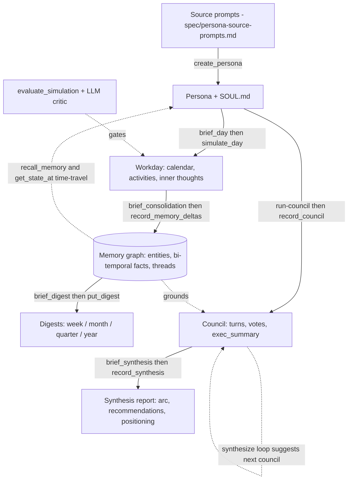
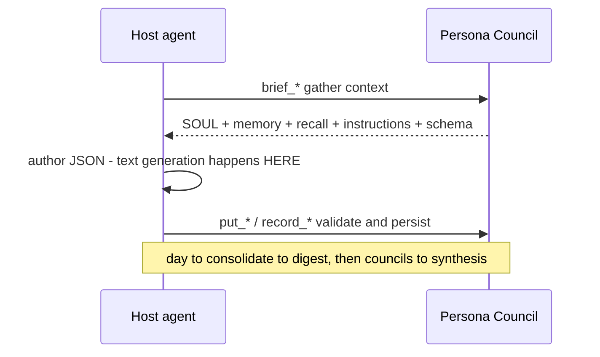
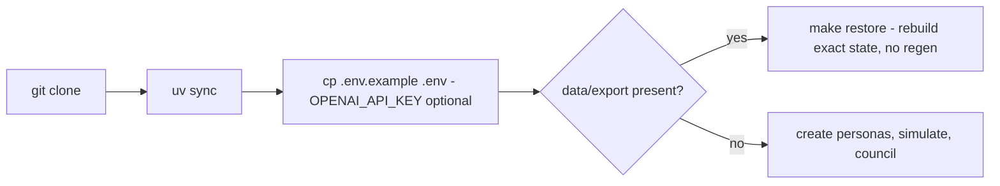

# Persona Council

Terminal-first, MCP-accessible persona simulation and council system.

Persona Council models customer profiles as persistent agents with durable
`SOUL.md` files, timestamped calendars, activity logs, inner thoughts, evidence,
and council-style debates. The web UI is only for inspecting the current state;
all creation, simulation, and council execution happens through CLI or MCP.

Simulation must be non-directional. Profiles are not nudged toward any product
thesis unless their own source description, evidence, recent calendar, or
explicit task context supports it.

---

## Quickstart — no coding needed

You do **not** need to be a programmer to run this. The whole system is driven by
an AI coding agent — **[Claude Code](https://claude.com/claude-code)** (recommended)
or **OpenAI Codex** — that does the setup and operation for you. You just talk to it.

**Step 1 — Install an AI coding agent.**
Install Claude Code (`https://claude.com/claude-code`) or Codex and open it in a
terminal or your editor. (Both have plain installers; the agent itself will help
if you get stuck.)

**Step 2 — Paste this prompt to the agent.** Replace the one line in brackets with
what *you* want to use personas for — it does not have to be architecture/BIM; it
can be anything (SaaS onboarding, a hiring panel, a city council, game NPCs, …):

> I am not a programmer — please do every step yourself and explain in plain
> language; ask me before anything destructive.
>
> 1. Check whether `git` and `uv` (the Python tool from Astral) are installed; if
>    not, install them for my operating system.
> 2. Clone `https://github.com/jhoetter/persona-council` and `cd` into it.
> 3. Run `uv sync`, then `cp .env.example .env`.
> 4. Read `AGENTS.md` and `CLAUDE.md` and follow them as your operating rules.
> 5. Run `make skills` so the persona skills are discoverable.
> 6. My use case is: **[describe who you want to simulate and what question you
>    want answered]**. Help me write a few persona source prompts for that, create
>    those personas, simulate a bit of their life, then run a council and a
>    synthesis on my question. Walk me through reading the result.

That is the entire onboarding. The agent will create the personas, run the
councils, and produce the synthesis report; you read it and decide what to ask next.

**Step 3 (optional) — an OpenAI API key.** Everything works **without** any API
key. A key only adds two niceties: generated **avatar images** for personas and
**semantic memory recall** (without it, recall still works on keyword/recency). To
add one:

1. Go to `https://platform.openai.com/`, sign up / log in.
2. Open **Billing** and add a small amount of credit (a few dollars is plenty).
3. Open **API keys → Create new secret key**, copy the value (starts with `sk-…`).
4. Open the `.env` file in the project and set `OPENAI_API_KEY=sk-…`. Save. Done —
   never share this key or commit it (the repo already ignores `.env`).

> **Privacy note for sharing this repo:** your own personas, councils and
> syntheses live under `data/export/`, `spec/persona-source-prompts.md` and
> `exports/`, and are all git-ignored — they stay on your machine and are never
> pushed. See *Data layout & privacy* below.

---

## How it works

Four layers build on each other: **persona → simulation/memory → council →
synthesis**. The server gathers context and persists; the **host agent authors
all text** (gather → author → write-back). No server-side text LLM calls.



The gather→author→persist contract every generative step follows:



## Setup




```bash
uv sync
cp .env.example .env
```

Text generation is performed by the MCP host agent, such as Claude Code or
Codex. Persona Council does not call text LLM APIs and does not use text API
keys; there is no deterministic simulation fallback. `OPENAI_API_KEY` is used
only for non-text helpers: avatar image generation and embeddings for semantic
memory recall (both optional — without the key, avatars are skipped and recall
falls back to keyword/recency/importance only).

Use `persona-council purge-runtime-data` or the MCP `purge_runtime_data` tool
for a clean slate.

## Data layout & privacy

All generated state lives under `data/`, and **all of it is git-ignored and
local-only** — nothing here is ever pushed to the public repo. There is exactly
one **portable snapshot artifact** (`data/export/`) that round-trips your full
state, and the rest is rebuildable runtime:

```
data/
  persona-council.db(-wal/-shm)   runtime SQLite — source of truth at runtime   [gitignored]
  personas/<slug>/SOUL.md,MEMORY.md   rendered projections (cache)               [gitignored]
  avatars/<slug>-<hash>.png           generated avatar images (cache)            [gitignored]
  export/                             portable snapshot of YOUR state             [gitignored · private]
    manifest.json, world_context.json
    personas/<slug>/  profile.json · SOUL.md · MEMORY.md · avatar.png
                      calendar.json · experiences.json · daily_summaries.json
                      memory.json (entities/facts/threads/plans/digests/links) · eval.json
```

Your **persona source prompts** (`spec/persona-source-prompts.md`) and **rendered
synthesis reports** (`exports/`) are git-ignored for the same reason — they are
your content, not the engine.

Move your exact state to another machine **without regenerating** — privately,
not through the public repo (e.g. copy the folder, a private archive, or your own
private fork):

```bash
make snapshot     # writes data/export/ — your private, portable state
# ...on the other machine, inside a clone of the repo:
make restore      # rebuilds the runtime DB + avatars + SOULs from data/export/
```

`make restore` round-trips the full graph deterministically. Embeddings are
re-derived on restore (not stored, to keep snapshots lean); recall stays
keyword-only until that backfill completes.

## Running

```bash
make dev            # web inspector on :8787
make dev-forwarded  # web inspector on :18787 (SSH tunnel friendly)
make mcp            # MCP server (stdio)
make skills         # symlink claude-skills/* into .claude/skills/ (Claude Code skill discovery)
make snapshot       # write private, local-only data/export/
make restore        # rebuild runtime DB from data/export/
```

The web UI is a Linear/Notion-grade inspector (`Overview · Personas · Councils ·
Synthesen` in a navigation-only sidebar; a personas card-grid home; Linear-style
list views; the **Synthese** report as a Notion-style document with table of
contents, properties rail, callouts, toggles and **PDF export**; each persona's
**🧠 Memory** page with project timelines, time-travel and recall). It supports
dark mode, a resizable/collapsible sidebar, breadcrumbs and keyboard navigation
(`g o/p/c/s`, `[`). It is read-only — all creation happens via CLI/MCP.

### Councils, strategies & synthesis

- **Council** = personas react to a prompt, grounded in their own memory (each can
  `recall` on demand). Run via the `run-council` skill; it supports a **moderated
  back-and-forth** (a host mediator reads the round and directs who replies next)
  and pluggable mediator **strategies** (`positive-deepdive`, `pain-discovery`,
  `tension`, `goal`) with a **hand-raising** convergence loop + upper bound.
- **Analysis → council loop → synthesis.** An **analysis** is a study with a
  question/goal; the `synthesize` skill is its **iterative driver**: from one
  statement it runs a council, reads the result and decides whether a follow-up
  council is worth it — authoring the next **self-contained** question itself
  (personas are council-stateless) — until the goal is reached or `max_councils`
  (default 10). The **councils are the log**; the **synthesis is the answer/report**.
- **Synthesis = the report.** Besides the cross-council prose (arc, recommendations,
  positioning, pain-solvers, segments) it carries a structured **per-persona `voices`**
  layer: each persona's `sentiment`, `relevance` (how much the topic touches their
  work), the one-line **key argument** (why), a **shift** (e.g. neutral→positiv with
  the triggering argument), and grounded **evidence** quotes. The web report
  (`/syntheses/{id}`) is answer-first with an interactive **Stimmen** panel
  (filter/sort by sentiment & relevance, expand for shift + evidence); councils sit
  underneath as the log. `export_synthesis` (md/json) is self-contained for handing to
  a downstream agent.

Skills live in [`claude-skills/`](claude-skills/) (`simulate-cohort`,
`run-council`, `synthesize`); run `make skills` once so Claude Code discovers them.

## Claude MCP

Add Persona Council as an MCP server in Claude Desktop or any Claude MCP client:

```json
{
  "mcpServers": {
    "persona-council": {
      "command": "uv",
      "args": ["run", "persona-council-mcp"],
      "cwd": "/absolute/path/to/persona-council"
    }
  }
}
```

Claude should use MCP tools such as `prepare_persona_agent_context`,
`simulate_day`, `run_council`, and `ask_persona`; persona-facing work must load
`SOUL.md` through `prepare_persona_agent_context`. The host agent authors text
content directly and submits structured JSON through MCP. `OPENAI_API_KEY` is
only needed for non-text helpers: `generate_avatar` and embeddings for semantic
`recall_memory` (recall still works without it, keyword/recency-only).

Agent and MCP operating instructions live in [AGENTS.md](AGENTS.md). Claude
should follow [CLAUDE.md](CLAUDE.md), which delegates to the same instructions.

The single project tracker — spec, reference, and the **Outstanding Work** list —
is [SPEC_TRACKER.md](SPEC_TRACKER.md). The supporting architecture and contracts
live under [`spec/`](spec/):
[memory-and-simulation-architecture.md](spec/memory-and-simulation-architecture.md),
[mcp-tool-contract.md](spec/mcp-tool-contract.md),
[simulation-loop-contract.md](spec/simulation-loop-contract.md). Your own persona
source prompts live in `spec/persona-source-prompts.md` (git-ignored, local-only)
— it is the canonical source from which personas are (re)built; write yours there.

## Credits

The council format was inspired by Leo Püttmann's
[`ai-council`](https://github.com/LeonardPuettmann/ai-council) — its
markdown-defined agents and select → debate → propose → vote → persist flow
seeded this project. Persona Council takes it further with durable persona state,
persistent memory, longitudinal simulation, and MCP-host-authored text. See
[SPEC_TRACKER.md](SPEC_TRACKER.md#inspiration-leonardpuettmannai-council) for the
full reference analysis.
