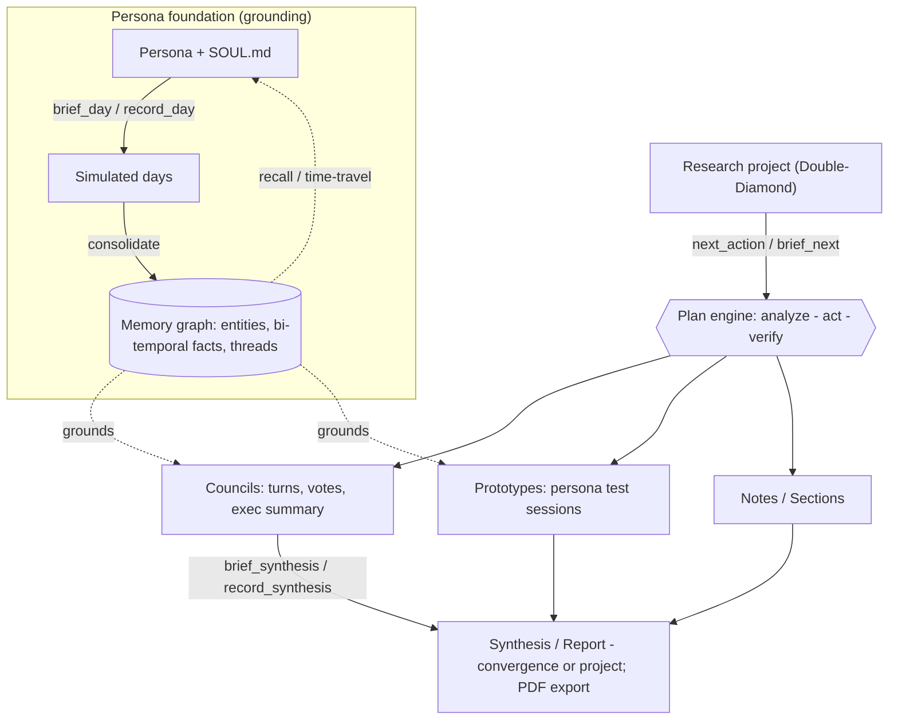

# Sonaloop

**An MCP server for customer-persona simulation, councils, and design-research synthesis.**

Sonaloop models customer profiles as persistent agents — durable `SOUL.md` files,
timestamped calendars, activity logs, inner thoughts, evidence, and council-style
debates. The **host agent authors all text**; Sonaloop gathers context, validates,
and persists. There are no server-side text-LLM calls.

Simulation is non-directional: profiles are never nudged toward a product thesis
unless their own source description, evidence, calendar, or explicit task context
supports it.

## Quickstart (MCP)

Add Sonaloop to Claude Desktop or any MCP client — no checkout needed:

```json
{
  "mcpServers": {
    "sonaloop": {
      "command": "uvx",
      "args": ["--from", "sonaloop", "sonaloop-mcp"]
    }
  }
}
```

Or install the CLI + MCP + web entrypoints directly:

```bash
uv tool install sonaloop      # or: pip install sonaloop
sonaloop setup                # optional: headless browser for prototype screenshots + PDF export
sonaloop info                 # show data dir, DB path, browser availability
```

Then point your host agent at the operating rules in [AGENTS.md](AGENTS.md) and let
it create personas, simulate, run councils, and synthesize.

## How it works

**Personas** are the grounded foundation: built host-authored (`brief_persona` →
`record_persona`), simulated day by day (`brief_day` → `record_day`) into a durable
**memory graph** they can `recall` and time-travel.

A **research project** (Double-Diamond) is then driven by a **plan engine**:
`next_action`/`brief_next` proposes the next *analyze → act → verify* step; the host
authors it and records evidence (`record_frame` / `link_evidence` / `record_judgment`
→ `complete_task`, with `assess_project` for progress). Its evidence is
memory-grounded **councils**, **prototypes** (personas test them), and **notes**,
which converge into a **synthesis / report** — the answer.

Every generative step follows one contract: `brief_*` (gather context) → the host
authors JSON → `record_*` / `put_*` (validate + persist). No server-side text-LLM calls.



## Configuration

`OPENAI_API_KEY` is **optional** — Sonaloop never uses it for text. It only enables
two niceties: persona **avatar images** and **semantic memory recall** (without it,
recall falls back to keyword/recency/importance). Set it in `.env` or the
environment.

When installed, writable state lives in a per-user data dir (`platformdirs`, e.g.
`~/.local/share/sonaloop`); override with `SONALOOP_DATA_DIR`. In a source checkout
it stays under `./data`. Read-only package data (methodology specs, MCP suggestions,
prototype templates) ships inside the wheel. Run `sonaloop purge-runtime-data` for a
clean slate.

## The inspector (web UI)

A read-only, Linear/Notion-grade inspector (`Overview · Personas · Councils ·
Synthesen`): a personas card-grid home, list views, each persona's **🧠 Memory**
page (project timelines, time-travel, recall), and the **Synthese** report as a
Notion-style document with table of contents, callouts, and **PDF export**. Dark
mode, keyboard nav (`g o/p/c/s`, `[`), bilingual (de/en, auto-detected; toggle via
`?lang=de|en` or `sonaloop set-language`). All creation happens via CLI/MCP.

## Councils & synthesis

- **Council** — personas react to a prompt, grounded in their own memory (each can
  `recall` on demand). The `run-council` skill supports a moderated back-and-forth
  with pluggable strategies (`positive-deepdive`, `pain-discovery`, `tension`,
  `goal`) and a hand-raising convergence loop.
- **Analysis → council loop → synthesis** — the `synthesize` skill is an iterative
  driver: from one statement it runs a council, reads the result, and authors the
  next self-contained question until the goal is met (or `max_councils`, default 10).
  The councils are the log; the **synthesis is the answer/report**.
- **Synthesis = the report** — cross-council prose (arc, recommendations,
  positioning, pain-solvers, segments) plus a structured per-persona **`voices`**
  layer (sentiment, relevance, key argument, shift, evidence quotes). The web report
  is answer-first with an interactive **Stimmen** panel; `export_synthesis` (md/json)
  is self-contained for handing to a downstream agent.

## From source (development)

```bash
git clone https://github.com/jhoetter/sonaloop && cd sonaloop
uv sync
cp .env.example .env          # OPENAI_API_KEY optional
make skills                   # symlink claude-skills/* for Claude Code discovery
make dev                      # web inspector on :8787 (dev-forwarded for :18787)
make mcp                      # MCP server (stdio)
```

Move your exact state between machines **without regenerating** (privately, not via
the public repo): `make snapshot` writes `data/export/` (your portable state), and
`make restore` rebuilds the runtime DB + avatars + SOULs from it. All of `data/`
(and your `spec/persona-source-prompts.md` + `exports/`) is git-ignored and
local-only — your content never leaves your machine.

For releases: bump `version` in `pyproject.toml` (a published version is immutable),
then `uv build && uv publish`. Refresh the vendored icons with `make icons`.

## Operating rules & docs

The host agent follows [AGENTS.md](AGENTS.md) (and [CLAUDE.md](CLAUDE.md), which
delegates to it). The single project tracker is [SPEC_TRACKER.md](SPEC_TRACKER.md);
architecture and contracts live under [`spec/`](spec/) — notably
[memory-and-simulation-architecture.md](spec/memory-and-simulation-architecture.md),
[mcp-tool-contract.md](spec/mcp-tool-contract.md), and
[simulation-loop-contract.md](spec/simulation-loop-contract.md).

## Credits

The council format was inspired by Leo Püttmann's
[`ai-council`](https://github.com/LeonardPuettmann/ai-council) — its markdown-defined
agents and select → debate → propose → vote → persist flow seeded this project.
Sonaloop takes it further with durable persona state, persistent memory, longitudinal
simulation, and MCP-host-authored text.
